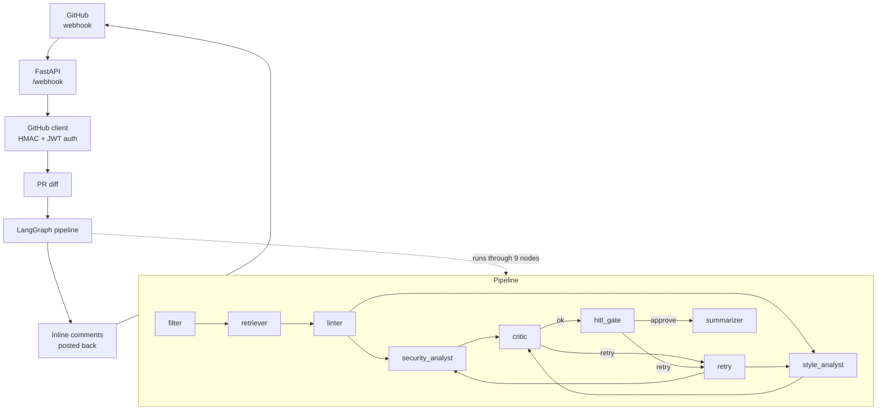

# ai-local-reviewer — project guide

> Course-submission walkthrough. Reads in 5 minutes.
> For setup details see [README.md](./README.md). For installing the optional MLX backend see [.claude/instruction-mlx-install.md](./.claude/instruction-mlx-install.md).

---

## What it is

`ai-local-reviewer` is a local AI bot that reviews GitHub Pull Requests against project-specific rules. Once installed as a GitHub App reviewer, it runs end-to-end without any cloud dependency: a LangGraph pipeline pulls the PR diff, retrieves matching coding rules from a Milvus + BM25 vector store, runs two specialised LLM analysts (security and style), filters their output through a deterministic critic, and pauses for a human approve/retry decision before posting inline comments back to GitHub.

The whole loop runs against local Ollama models (qwen3.5:9b by default), with optional providers for Anthropic, Gemini, and OpenAI controlled by a single env variable.

---

## Architecture at a glance



Three things make this design work for a local model:

1. **RAG-grounded prompts** — analysts only see rules that actually apply to the PR's tech stack, so a 9B model is not asked to know everything.
2. **Critic guards** — every LLM comment passes 4 deterministic checks before being posted, catching the most common hallucinations (wrong line numbers, fabricated rule IDs, wrong file types).
3. **HITL gate** — a human always sees the comments before they hit GitHub, so a bad model can never publish noise.

---

## Pipeline walkthrough

Every box in the diagram emits a line in `progress.log` so you can follow a run in real time.

| Node | Purpose | What it consumes | What it produces |
|------|---------|------------------|------------------|
| **filter** | strips lockfiles, binaries and noise from the diff | raw PR diff | clean diff text + state reset |
| **retriever** | pulls project rules from Milvus + BM25 by detected stack | clean diff (file paths) | top-K rules per category, RAG trace |
| **linter** | runs ruff on Python added lines as deterministic pre-findings | added lines per `.py` file | seed findings injected into analyst prompts |
| **security_analyst** | LLM scan for OWASP-class vulnerabilities | system prompt + diff | comments tagged with OWASP id + severity |
| **style_analyst** | LLM scan for type safety, dead code, framework idioms | system prompt + diff | comments tagged with rule_id |
| **critic** | applies G1-G4 guards + rule-ID membership to LLM comments | comments + diff + RAG | survivors, rejection reasons |
| **retry** | clears analyst state for another pass on critic feedback | critic feedback | empty state, route back to analysts |
| **hitl_gate** | pauses for human approve / retry decision | survivors, iterations | `approve` or `retry` decision |
| **summarizer** | deterministic executive summary from surviving comments | survivors | markdown summary, no LLM call |

> **Source of truth** — descriptions live in `src/core/pipeline_doc.py:NODE_DESCRIPTIONS`. The progress logger imports from the same map, so changes propagate to both docs and runtime traces automatically.

### Critic guards in one paragraph

The critic rejects an analyst comment if any of these is true:
- **G1** — line is not in the diff's `+` set for that path
- **G2** — path is not in the diff at all
- **G3** — backtick-quoted identifiers in the body don't appear in the file's added lines
- **G4** — comment cites a rule whose category does not match the file's tech (with a compatibility map: e.g. TS rules are valid on `.tsx` since `.tsx` is TypeScript)

Plus two membership checks: `UNKNOWN_RULE` (rule ID not in index) and `GUIDELINE_MISS` (rule not retrieved for this PR).

---

## How to run a demo

### 1. Bring up dependencies

```bash
# Ollama (local LLM runtime)
ollama serve &
ollama pull qwen3.5:9b

# Milvus (vector store for rules)
docker compose up -d milvus

# Index the rules into Milvus once
python -m scripts.index_rules
```

### 2. Configure `.env`

The defaults work for local Ollama. Key entries:

```env
TYPE_AGENTS=local
MODEL_SECURITY=qwen3.5:9b
MODEL_STYLE=qwen3.5:9b
ENABLED_AGENTS=security,style
DIFF_FORMAT=markdown
HITL_AUTO_APPROVE=false
```

### 3. Start the server and tunnel

```bash
uvicorn src.main:app --port 8000 &
ngrok http 8000
```

Paste the ngrok URL into your GitHub App's webhook settings: `https://<id>.ngrok.io/webhook`.

### 4. Trigger a review

On any PR in the GitHub repo where the App is installed, click **Re-request review** for the bot. The app will:
1. Validate the webhook HMAC.
2. Fetch the PR diff.
3. Run the pipeline — you can `tail -f output/processes/<latest>/progress.log` to watch.
4. Pause for HITL — type `a` (approve) or `r` (retry) in the uvicorn terminal.
5. Post inline comments to GitHub.

---

## How to read a run

Every webhook trigger creates one folder under `output/processes/`:

```
output/processes/
└── olhaarchai-test-ai-review-7-2026-04-25T01-15-52/
    ├── progress.log         ← stage timeline (this file is the one to skim first)
    ├── review.md            ← full transcript: RAG, prompts, raw LLM, critic, comments
    ├── diff.patch           ← exact diff the analysts saw, post-filter
    ├── security-prompt.txt  ← system + user message sent to the security LLM
    └── style-prompt.txt     ← same, for style
```

### `progress.log` — the timeline

Every node logs ENTER + EXIT with a description and key metrics:

```
01:15:52.685  START  thread_id=olhaarchai/test-ai-review#7
01:15:52.687  ENTER  retriever        — pulls project rules from Milvus + BM25 by detected stack
01:15:53.081  EXIT   retriever         (0.39s) kept=20 cats=5 dense=14 bm25=38
01:15:53.083  ENTER  security_analyst — LLM scan for OWASP-class vulnerabilities
01:17:44.499  EXIT   security_analyst  (111.42s) agent=security comments=15 raw_chars=3131
01:19:18.007  PAUSE  hitl_gate          (HITL interrupt — waiting for user)
01:19:35.398  ENTER  hitl_gate         — pauses for human approve / retry decision
01:19:35.398  EXIT   hitl_gate          (0.00s) action=approve
01:19:40.428  END    thread_id=olhaarchai/test-ai-review#7
```

Read top to bottom — every line is one event with timestamp, action (ENTER / EXIT / PAUSE / ERROR / END), the node name, and either a description or a duration + metrics.

### `review.md` — the full transcript

Sections (in order):
1. **HITL** — final action and number of critic iterations
2. **Models** — which provider + model each agent ran on
3. **Stack / context** — files in the PR and detected tech
4. **RAG breakdown** — for each retrieved category: dense/BM25 hits, fused order, kept rules
5. **Retrieved guidelines** — the union of rules injected into prompts
6. **Lint findings** — deterministic ruff output (Python only)
7. **Analyst prompts & responses** — for each agent: full system prompt, full diff, raw LLM output
8. **Critic breakdown** — table of rejection reasons + counts
9. **Critic rejections** — every dropped comment with reason
10. **Surviving comments** — what got posted to GitHub
11. **Summary** — executive summary text
12. **Timings** — wall-clock per analyst

Use it to attribute any hallucination to a specific stage:
- comment cites a fake rule? → check **Retrieved guidelines**
- model invented a line number? → check **Analyst prompts & responses → raw_text**
- critic dropped a real finding? → check **Critic rejections**

### `<agent>-prompt.txt` — reproducible prompts

Paste straight into `ollama run` to reproduce the exact LLM call:

```bash
cat output/processes/<run>/security-prompt.txt | ollama run qwen3.5:9b
```

Useful when iterating on the system prompt — change persona/focus.md, re-run the same PR, diff the prompts.

---

## Architecture decisions (rationale)

When the supervisor asks "why X and not Y":

- **LangGraph over plain async** — built-in `interrupt()` for HITL is invaluable; without it the resume-on-approve flow would need a custom queue + checkpointer.
- **Hybrid retrieval (Milvus + BM25 + RRF)** — semantic search alone misses rule-IDs; lexical alone misses semantic similarity. Reciprocal Rank Fusion combines both ranks without any weighting hyperparameter.
- **Sentence-transformers `all-MiniLM-L6-v2`** — 80 MB, runs on CPU, good enough for short rule snippets. Anything bigger is over-engineered for this corpus.
- **Two specialised analysts (security, style)** — a single "do everything" prompt forces the model to juggle 20+ rules; splitting by domain narrows context, reduces single-rule lock-in, and lets each agent use a different model if useful.
- **Problem-first prompts with concrete patterns** — instead of "review for OWASP", the prompt lists 10 explicit code patterns (`JWT_SECRET = '...'`, `dangerouslySetInnerHTML`, `eval(x)`). Pattern-matching is what 7-9B local models do well; abstract OWASP reasoning is what they fail at.
- **Critic G1-G4** — covers ~80% of common hallucinations deterministically. The remaining 20% (semantic mismatches) is what HITL is for.
- **`reasoning=False` for qwen3 on Ollama** — qwen3's `<think>...</think>` prefix is incompatible with Ollama's `format=json` (model burns the entire `num_predict` budget on thinking, never emits JSON). Disabling reasoning at the API level recovers usability while still benefiting from the larger 9B parameter count.
- **Markdown diff format for analysts** — explicit `  N: content` line numbers eliminate the `@@ -L,l +L,l @@` arithmetic class of errors. ~30-50% prefill token reduction on refactor PRs as a side effect.
- **Per-PR run folder** — every artefact for one webhook lives in `output/processes/<slug>-<ts>/`. Enables side-by-side diffing of model variants without polluting a flat directory.
- **Prompt dump per call** — `<agent>-prompt.txt` makes the LLM call reproducible offline. Critical for debugging "why did the model do X" without re-triggering the webhook.
- **Pluggable providers via `TYPE_AGENTS`** — switching from local qwen to Anthropic for a high-stakes PR is one env-var change. No code edits.

---

## Tech stack reference

- **Python 3.11+**, `uv` or `pip` for dependencies
- **FastAPI** + uvicorn — HTTP webhook
- **LangGraph** — state machine for the pipeline (with SQLite checkpointer)
- **Ollama** — local LLM runtime (qwen2.5, qwen3, llama3, mistral...)
- **Milvus** — dense vector store
- **rank-bm25** — sparse retrieval
- **sentence-transformers** — embedding model
- **ruff** — Python deterministic linter (seeds analyst prompts)
- **httpx** — async GitHub API client
- **PyJWT** — GitHub App authentication

For a comprehensive setup walk-through (env, ngrok, GitHub App registration), see [README.md](./README.md).
