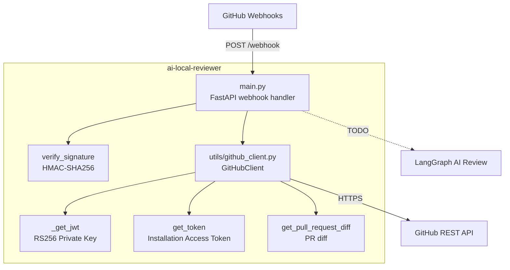

# ai-local-reviewer

A GitHub App bot that automatically reviews Pull Requests. When added as a reviewer, it receives a webhook from GitHub, fetches the PR diff, and (in the future) sends it to LangGraph for AI analysis.

---

## Architecture




---

## Requirements

- Python 3.11+
- [GitHub App](https://docs.github.com/en/apps/creating-github-apps) with a private key (`.pem`)
- A publicly accessible URL for the webhook (e.g. via [ngrok](https://ngrok.com/))

---

## Setup & Run

### 1. Clone the repository

```bash
git clone <repo-url>
cd ai-local-reviewer
```

### 2. Create a virtual environment and install dependencies

```bash
python -m venv .venv
source .venv/bin/activate   # Windows: .venv\Scripts\activate
pip install -r requirements.txt
```

### 3. Configure environment variables

Copy `.env_example` to `.env` and fill in the values:

```bash
cp .env_example .env
```

```env
GITHUB_APP_ID=123456                              # Your GitHub App ID
GITHUB_WEBHOOK_SECRET=your_webhook_secret         # Secret from GitHub App settings
GITHUB_PRIVATE_KEY_PATH=./oh-local-reviewer-ai.pem  # Path to the .pem file
GITHUB_BOT_NAME=your-bot-name                     # Bot login (without [bot] suffix)
```

### 4. Start the server

```bash
uvicorn src.main:app --reload --port 8000
```

The server will be available at `http://localhost:8000`.

### 5. Expose the webhook via ngrok (for local development)

```bash
ngrok http 8000
```

Copy the HTTPS URL from ngrok and set it in your GitHub App settings:
`Webhook URL: https://<ngrok-id>.ngrok.io/webhook`

---

## How it works

1. A developer adds the bot as a reviewer on a PR.
2. GitHub sends `POST /webhook` with event `pull_request` and `action: review_requested`.
3. The app verifies the request signature via HMAC-SHA256.
4. If the requested reviewer is the bot, it authenticates with GitHub API using JWT → Installation Access Token.
5. Downloads the PR diff in `.diff` format.
6. *(TODO)* Sends the diff to LangGraph for AI review and posts comments on the PR.
