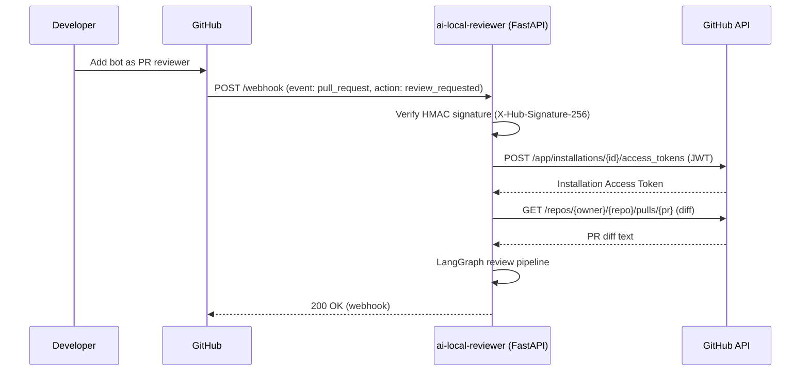
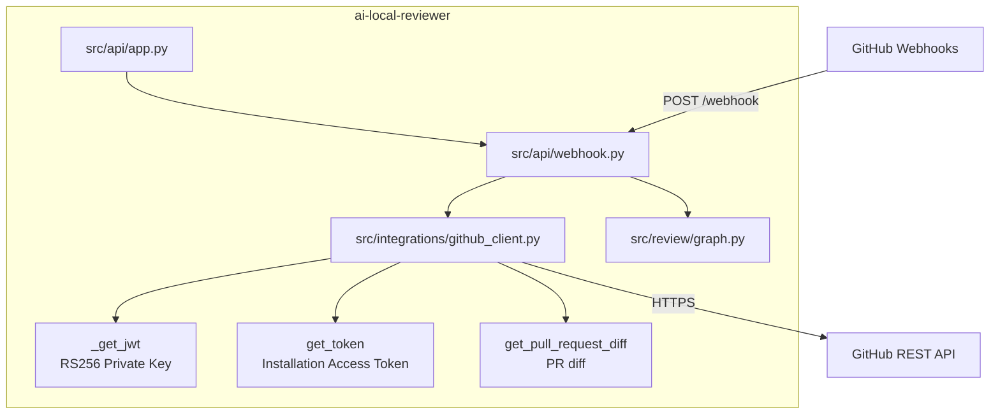
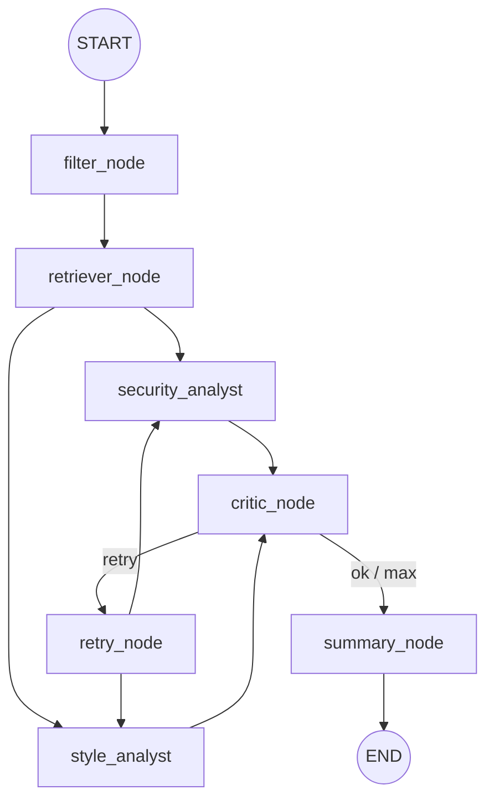

# ai-local-reviewer

A GitHub App bot that automatically reviews Pull Requests. When added as a reviewer, it receives a webhook from GitHub, fetches the PR diff, runs a LangGraph review pipeline, and posts comments back to GitHub.

---

## Architecture





### LangGraph review pipeline



Key points:
- **Critic loop** re-runs analysts until valid output or max iterations.
- **HITL pause** happens before summarizer when enabled.
- **Checkpointer** persists state per PR (thread_id).
- **Tools** are available to analysts (web_search/read_url) when models support tool-calling.

---

## Requirements

- Python 3.11+
- [GitHub App](https://docs.github.com/en/apps/creating-github-apps) with a private key (`.pem`)
- A publicly accessible URL for the webhook (e.g. via [ngrok](https://ngrok.com/))

---

## Setup & Run

### 1. Clone the repository

```bash
git clone <repo-url>
cd ai-local-reviewer
```

### 2. Create a virtual environment and install dependencies

```bash
python -m venv .venv
source .venv/bin/activate   # Windows: .venv\Scripts\activate
pip install -r requirements.txt
```

### 3. Configure environment variables

Copy `.env_example` to `.env` and fill in the values:

```bash
cp .env_example .env
```

```env
GITHUB_APP_ID=123456                              # GitHub App ID
GITHUB_WEBHOOK_SECRET=your_webhook_secret         # Webhook secret
GITHUB_PRIVATE_KEY_PATH=./oh-local-reviewer-ai.pem  # Path to .pem file
GITHUB_BOT_NAME=your-bot-name                     # Bot login (without [bot] suffix)

OLLAMA_MODEL_SECURITY=qwen2.5:7b                  # Security analyst model (tool-capable)
OLLAMA_MODEL_STYLE=qwen2.5:3b                     # Style analyst model (tool-capable)
OLLAMA_MODEL_FAST=llama3.2:1b                     # Summarizer model
OLLAMA_BASE_URL=http://localhost:11434
OLLAMA_REQUEST_TIMEOUT=300
SUMMARIZER_USE_LLM=false

MILVUS_HOST=localhost
MILVUS_PORT=19530
CHECKPOINT_SQLITE_PATH=.data/reviewer_checkpoints.sqlite
# CHECKPOINT_POSTGRES_DSN=postgresql+asyncpg://...

WEB_SEARCH_MAX_RESULTS=5
READ_URL_MAX_CHARS=5000

LOG_LEVEL=INFO
```

### 4. Start the server

```bash
uvicorn src.main:app --reload --port 8000
```

The server will be available at `http://localhost:8000`.

### 5. Expose the webhook via ngrok (for local development)

```bash
ngrok http 8000
```

Copy the HTTPS URL from ngrok and set it in your GitHub App settings:
`Webhook URL: https://<ngrok-id>.ngrok.io/webhook`

---

## How it works

1. A developer adds the bot as a reviewer on a PR.
2. GitHub sends `POST /webhook` with event `pull_request` and `action: review_requested`.
3. The app verifies the request signature via HMAC-SHA256 and fetches the PR diff via GitHub API.
4. The LangGraph pipeline runs: filter → retriever → security/style analysts → critic loop → summarizer.
5. Optional HITL pause allows editing/approval before final summary.
6. The bot posts inline comments and a summary review back to GitHub.
